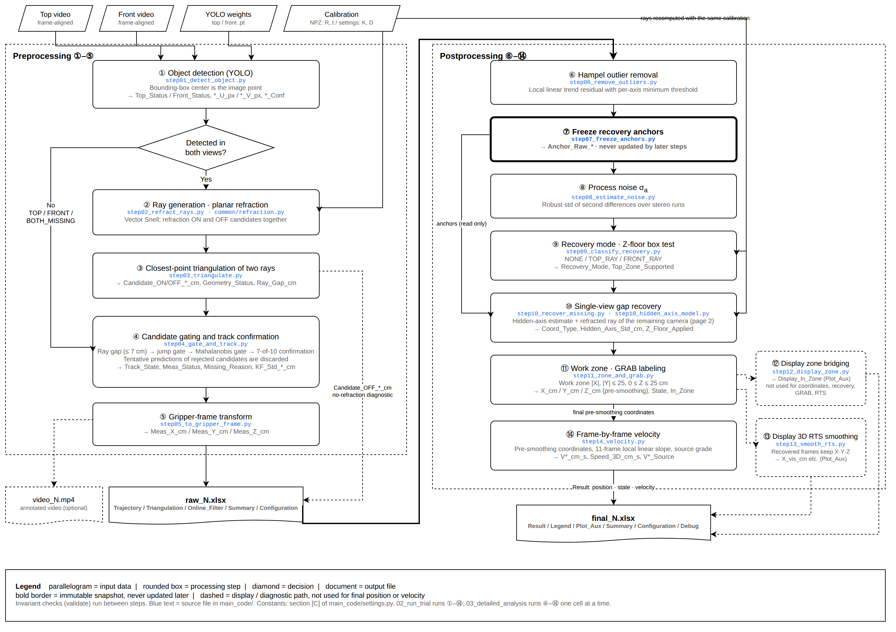

# Underwater Gripper Object 3D Tracking (Top + Front Cameras)

The object is detected with YOLO in the top and front camera videos and triangulated with refraction correction at the water surface and the front tank wall. The output is the 3D position relative to the gripper center and the frame-by-frame velocity. When the object is hidden from one camera, its position is recovered from the remaining camera's refracted ray and an estimate of the unobserved axis.

| Notebook | Purpose | GPU | When to run | Colab |
|---|---|---|---|---|
| `01_calibration` | Camera calibration NPZ from the ArUco marker (R, t) | No | Once after moving a camera | [](https://colab.research.google.com/github/dodokim777-boop/underwater-gripper-tracking/blob/main/workflow/01_calibration.ipynb) |
| `02_run_trial` | Steps ①–⑭ for one trial → `raw_N.xlsx`, `video_N.mp4`, `setup_N.png`, `final_N.xlsx` | Yes | Every trial | [](https://colab.research.google.com/github/dodokim777-boop/underwater-gripper-tracking/blob/main/workflow/02_run_trial.ipynb) |
| `03_detailed_analysis` | Steps ⑥–⑭ one cell at a time (rerun or inspect postprocessing) → `final_N.xlsx` | No | When needed | [](https://colab.research.google.com/github/dodokim777-boop/underwater-gripper-tracking/blob/main/workflow/03_detailed_analysis.ipynb) |
| `04_contact_events` | Mean velocity 1 s and 2 s before each gripper contact → Contact_Events sheet | No | After 02, when contact frames are known | [](https://colab.research.google.com/github/dodokim777-boop/underwater-gripper-tracking/blob/main/workflow/04_contact_events.ipynb) |

## Pipeline



Step ⑩ (single-view recovery) in detail: [`reference/pipeline_step10.png`](reference/pipeline_step10.png). Editable source: [`reference/pipeline_diagram.drawio`](reference/pipeline_diagram.drawio) (open in diagrams.net; export PNG after editing).

Steps ⑫ and ⑬ are for plotting only and do not affect the final position or velocity. Columns of each step are listed in [`reference/variables_by_step.md`](reference/variables_by_step.md).

## Data on Google Drive

Data is kept on Drive, not in this repository. One folder per experiment day; the folder names `Top`, `Front`, `setup`, and `result` are fixed.

```
MyDrive/<experiment day>/
├── Top/t1.mp4, t2.mp4, …          ← top videos (trial number = last number in the file name)
├── Front/f1.mp4, f2.mp4, …        ← front videos (same trial numbers)
├── setup/
│   ├── experiment_settings.yaml   ← day settings, created by cell 0
│   ├── top_calib.mp4, front_calib.mp4   ← marker videos for 01_calibration
│   ├── manual_calib_top.npz, manual_calib_front.npz   ← written by 01_calibration (+ _check.png)
│   └── top_best.pt, front_best.pt ← YOLO weights
└── result/                        ← outputs
```

## Running

1. Open a notebook from its Colab badge. `02_run_trial` uses a GPU runtime (T4).
2. **Cell 0** installs the dependencies, mounts Drive, and asks for the day folder path (Enter reuses the last one).
   - First run for that day: a form opens. Enter the water height, check the other values and the files found in `setup/`, and click **Save**. `setup/experiment_settings.yaml` is created.
   - Later runs: the current settings are shown. **Edit settings** opens the form again; **Edit full file** opens the whole file (cameras, tank, algorithm constants).
3. **Cell 1** asks for the trial number, finds the videos with that number in `Top/` and `Front/`, and checks files and values.
4. **Cell 2** (02) runs a short test. Check `result/test_setup.png`.
5. **Cell 3** (02) runs the whole trial: preprocessing and postprocessing.
6. **Cell 4** (02) plots the result: stereo points (black), top-only recovered (blue), front-only recovered (green), smoothed display line (orange), work zone (yellow), GRAB (red).

For the next trial, run cell 1 again. Run `01_calibration` only after moving a camera.

Contact analysis (`04_contact_events`): after watching `video_N.mp4`, enter the first contact frame of each event in the cell 2 form and click **Save** (`result/contact_N.csv`); cell 3 adds the Contact_Events sheet to `final_N.xlsx`.

## Settings (setup/experiment_settings.yaml)

| Level | Key | Set in |
|---|---|---|
| Every day | `water.surface_z_cm` | Cell 0 form |
| Check every day | `inputs.calib_*_npz`, `inputs.*_weights`, `calibration.top_video`, `calibration.front_video` | Cell 0 form (files found in `setup/`) |
| Check every day | `setup.motor_center_in_id0_cm`, `models.target_class_names`, `video.save_annotated_video` | Cell 0 form |
| Rarely | `sync.*_time_offset_sec` (0 for frame-aligned videos), `calibration.frame_index` | Edit full file |
| Equipment change | `cameras.*` (K, dist, model), `setup.front_wall_y_cm`, `setup.marker_size_cm`, `setup.front_wall_marker_*` | Edit full file |
| Modify with caution | `advanced` (section [C] of `main_code/settings.py`; changing them changes the results) | Edit full file |

## Outputs

| File | Contents |
|---|---|
| `result/raw_N.xlsx` | Trajectory / Triangulation / Online_Filter / Summary / Configuration |
| `result/final_N.xlsx` | **Result** (pre-smoothing position, state, velocity; use for analysis) / Legend / Plot_Aux (smoothed position for plots) / Summary / Configuration / Debug, plus Contact_Events after `04_contact_events` |
| `result/video_N.mp4` | Annotated video, top and front side by side (optional) |
| `result/setup_N.png` | World marker corners projected on the front view |
| `result/contact_N.csv` | Contact frames entered in `04_contact_events` (Event_ID, Contact_Frame, Criterion, Note) |
| `result/config.yaml` | Settings of the latest run, without file paths (replaced at every run) |
| `result/test_raw.xlsx`, `test_video.mp4`, `test_setup.png` | Outputs of the 02 test run (replaced at every test run) |
| `<NPZ name>_check.png` | Detected marker and world axes, next to each NPZ (from `01_calibration`) |

N is the trial number entered in cell 1. Running a trial again replaces its files.

The origin is the motor (gripper) center, and the axes follow the floor ID0 marker.

## Repository layout

```
experiment_settings.yaml     day settings template (cell 0 creates setup/experiment_settings.yaml from it)
requirements.txt
workflow/                    notebooks: 01 calibration · 02 run trial · 03 detailed analysis · 04 contact events
preparation/                 calibration NPZ (run before the pipeline)
main_code/
  settings.py                default constants, settings-file loading and checks
  common/                    refraction, file utilities, notebook prompts, settings form, result plot
  preprocessing/             steps ①–⑤ (step01_ … step05_), run_preprocessing.py
  postprocessing/            steps ⑥–⑭ (step06_ … step14_), run_postprocessing.py, contact_events.py
reference/                   variables by step, pipeline diagram (drawio + PNG)
edit_check/                  check that results are unchanged after a code edit
```

## Running locally (optional)

```bash
pip install -r requirements.txt
python -c "from main_code import settings; settings.configure('DAY/setup/experiment_settings.yaml', data_root='DAY', trial=1); from main_code.postprocessing.run_postprocessing import run_postprocessing; run_postprocessing()"
```

Replace `DAY` with a local day folder.
